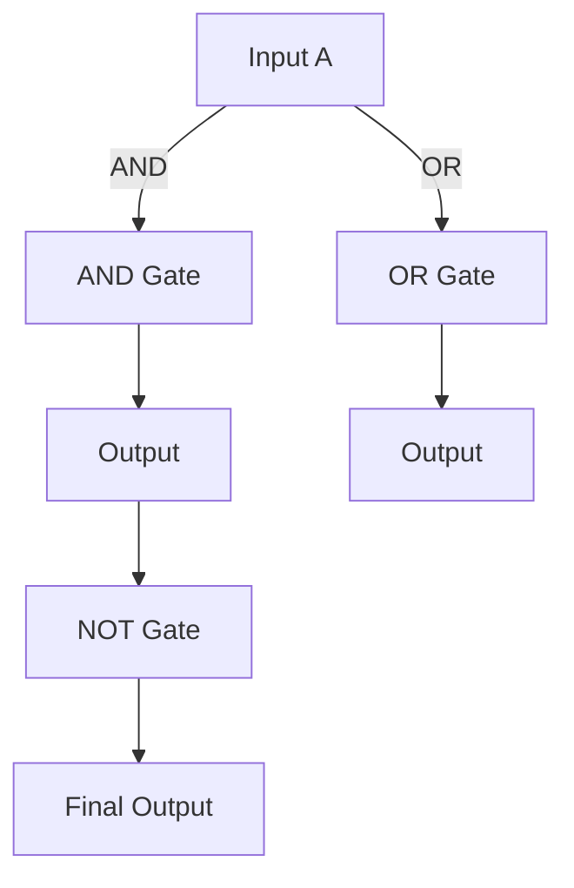

# **이산수학 (Discrete Mathematics)**

## **집합 (Set)**

> **집합**은 순서가 지정되지 않은 원소들의 모임
> 
- **원소 나열법**: 집합의 원소들을 일일이 나열하여 표현합니다.
    - A={1,2,3}
- **조건 제시법**: 집합의 원소들이 만족해야 하는 조건을 표현합니다.
    - B = $\{ x \mid x \text{는 짝수이다} \}$

### 집합의 주요 개념

- **전체집합 (Universal Set)**
    
    전체집합은 모든 집합의 원소가 포함된 집합
    
    보통 U로 표기하며, 이 집합에 속하는 모든 원소들이 포함
    
- **공집합 (Empty Set)**
    
    공집합은 원소가 하나도 없는 집합
    
    보통 $\emptyset$또는 ${}\{\}$로 표기합니다.
    
- **부분집합 (Subset)**
    
    집합 A가 집합B의 부분집합이란 A의 모든 원소가 B에도 포함되면, $A \subseteq B$라고 표현합니다.
    
- **멱집합 (Power Set)**
    
    주어진 집합의 모든 부분집합들의 집합을 멱집합이라고 합니다. 예를 들어, A={1,2} $A = \{1, 2\}$일 때, $P(A) = \{\emptyset, \{1\}, \{2\}, \{1, 2\}\}$입니다.
    
- **합집합 (Union)**
    
    두 집합 AA와 BB의 합집합은 $A \cup B$로 표현하며, A와 B의 모든 원소를 포함합니다.
    
- **교집합 (Intersection)**
    
    두 집합 AA와 BB의 교집합은 $A \cap B$로 표현하며, A와 B에 공통으로 속하는 원소들을 포함합니다.
    
- **여집합 (Complement)**
    
    집합 AA의 여집합은 전체집합 U에서 A를 제외한 원소들입니다. 보통 $A'$ 또는 $\overline{A}$로 표기합니다.
    
- **차집합 (Difference)**
    
    집합 A에서 집합 B의 원소를 뺀 집합을 차집합이라고 하며, $A - B$로 표기합니다.
    

### **순열 (Permutation)**

> 서로 다른 원소들을 순서를 고려하여 일렬로 배열
> 

$$
P(n, r) = \frac{n!}{(n - r)!}
$$

### 예제

- 콘테스트에 참가한 100명의 다른 사람들 중에서 1등 수상자, 2등 수상자, 3등 수상자를 선정하는 방법은 몇 가지입니까?
    
    $P(100, 3) = \frac{100!}{(100 - 3)!} = \frac{100 \times 99 \times 98 \times 97!}{97!} = 100 \times 99 \times 98  = 970200$
    
- 한 판매원이 여덟 개의 다른 도시를 방문해야 한다고 가정해 보자. 그녀는 지정된 도시에서 여행을 시작해야하지만, 원하는 순서대로 다른 7개 도시를 방문할 수 있다. 판매원이 이러한 도시들을 방문할 때 사용할 수 있는 주문은 얼마나 많은가?
    
    $7! = 7\times 6\times 5\times 4\times 3 \times 2\times 1 = 5040$
    
- ABCDEFGH 문자의 순열에 ABC 문자열이 포함된 것은 몇개입니까?
    
    $6! = 6\times 5\times 4\times 3 \times 2\times 1 = 720$
    

### **조합 (Combination)**

> 주어진 원소들 중에서 순서를 고려하지 않고 일부를 선택하는 방법의 수
> 

$$
C(n, r) = \frac{n!}{r!(n - r)!}
$$

- $r!(n - r)!$는 순서를 고려하지 않기 위해 중복을 제거하는 과정입니다.

### 예제

- 52장의 카드로 구성된 표준 덱에서 5장의 카드로 구성된 포커 핸드를 몇 개나 처리할 수 있습니까? 또한 52장의 카드 덱에서 47장의 카드를 선택하는 방법은 몇 가지입니까?
    
    $C(52, 5) = \frac{52!}{5!(52 - 5)!} = \frac{52 \times 51 \times 50 \times 49 \times 48}{5!} = 2598960$
    
- 10명으로 구성된 테니스 팀에서 5명의 선수를 선발하여 다른 학교의 경기를 보러 가는 방법은 얼마나 많은가
    
    $C(10, 5) = \frac{10!}{5!(10- 5)!} = \frac{10 \times 9\times 8\times 7\times 6}{5!} = 252$
    
- 30명으로 구성된 그룹이 화성으로의 첫 임무를 수행하기 위해 우주 비행사 훈련을 받았습니다. 이 임무를 수행할 6명의 승무원을 선택하는 방법은 몇 가지가 있습니까?
    
    $C(30, 6) = \frac{30!}{6!(30- 6)!} = \frac{30\times 29\times 28\times 27\times 26 \times 25}{6!} = 593775$
    

---

## **함수 (Functions)**

> 한 집합의 원소를 다른 집합의 원소에 대응시키는 규칙
> 

### **일대일 함수 (Injective Function)**

함수에서 각 입력 값에 대해 출력 값이 유일하게 대응하는 함수

즉, 서로 다른 입력 값이 서로 다른 출력 값을 가집니다.

- Injection(단사): f(a) = f(b) → a = b

### **전사 함수 (Surjective Function)**

치역 == 공역

### **전단사 함수 (Bijective Function)**

1:1 + 치역==공역

정의역 공역 치역

---

## **관계 (Relations)**

한 집합의 원소들이 다른 집합의 원소들과 어떻게 연결되는 지

### **이진 관계 (Binary Relations)**

이진 관계는 두 집합 A와 B 사이의 관계를 정의하는 방법입니다. 이는 집합 A의 원소와 집합 B의 원소들 사이에 관계를 설정하는 것을 의미합니다. 이 관계는 집합 AAA와 집합 BBB의 원소들의 **쌍**으로 나타낼 수 있습니다.

- 이진 관계 $R \subseteq A \times B$는 **"A의 원소와 B의 원소 사이에 관계가 존재한다"**라는 의미입니다.
    
    예를 들어:
    
    - $A = \{1, 2, 3\}, B = \{a, b\}A={1,2,3},B={a,b}$
    - 관계 R={(1,a),(2,b),(3,a)} 이면, 1은 a와, 2는 b와, 3은 a와 관계가 있다는 의미입니다.
        
        $R = \{(1, a), (2, b), (3, a)\}$
        

즉, 이진 관계 RRR는 집합 AAA의 원소와 집합 BBB의 원소들 간에 **쌍**을 이루는 관계로 표현됩니다. AAA와 BBB가 같을 수도 있고 다를 수도 있습니다. 그럴 때는 **내부 관계** 또는 **자기 관계**라고 부를 수도 있습니다.

### **반사적 관계 (Reflexive Relation)**

**반사적 관계**는 집합 A의 모든 원소가 자기 자신과 관계를 가진다는 성질을 갖는 관계입니다.

- 집합 A에 대해, 관계 R가 **반사적**이라는 것은 집합 A의 모든 원소 a에 대해 (a,a)가 R에 포함된다는 것을 의미합니다.
    
    즉, 모든 $a \in A$에 대해, $a \sim a$가 성립해야 합니다.
    
    $$
    ⁍
    $$
    

### **예시**:

1. 집합 $A = \{1, 2, 3\}$에 대해 관계 $R = \{(1, 1), (2, 2), (3, 3)\}$가 있을 때:
    - (1,1)(1, 1)(1,1), (2,2), (3,3)가 모두 관계 R에 포함되어 있으므로, 이 관계는 **반사적**입니다.
        
        (2,2)(2, 2)
        
        (3,3)(3, 3)
        
        RR
        
2. 집합 A={x,y,z}A = \{x, y, z\}A={x,y,z}에 대해 관계 R={(x,x),(y,y)}R = \{(x, x), (y, y)\}R={(x,x),(y,y)}가 있을 때:
    - (z,z)(z, z)(z,z)가 포함되지 않으므로, 이 관계는 **반사적이지 않습니다**.

### 1.3 **대칭적 관계 (Symmetric Relation)**

**대칭적 관계**는 한 원소가 다른 원소와 관계를 갖는다면, 반대로도 관계가 성립해야 한다는 성질을 갖는 관계입니다.

- 관계 R가 **대칭적**이라는 것은 만약 a∼b이면, 반드시 b∼a가 성립해야 한다는 의미입니다.
    
    RR
    
    a∼ba \sim b
    
    b∼ab \sim a
    

### **조건 제시법 (Formal Definition)**:

∀a,b∈A, (a,b)∈R⇒(b,a)∈R\forall a, b \in A, \ (a, b) \in R \Rightarrow (b, a) \in R

∀a,b∈A, (a,b)∈R⇒(b,a)∈R

### **예시**:

1. 집합 A={1,2,3}에 대해 관계 R={(1,2),(2,1),(3,3)}가 있을 때:
    
    A={1,2,3}A = \{1, 2, 3\}
    
    R={(1,2),(2,1),(3,3)}R = \{(1, 2), (2, 1), (3, 3)\}
    
    - (1,2)∈R(1, 2) \in R(1,2)∈R이고, (2,1)∈R이므로, R는 **대칭적**입니다.
        
        (2,1)∈R(2, 1) \in R
        
        RR
        
2. 집합 A={x,y,z}에 대해 관계 R={(x,y),(y,z)}가 있을 때:
    
    A={x,y,z}A = \{x, y, z\}
    
    R={(x,y),(y,z)}R = \{(x, y), (y, z)\}
    
    - (x,y)∈R(x, y) \in R(x,y)∈R이지만 (y,x)∈/R, (y,z)∈R이지만 (z,y)∈/R이므로, 이 관계는 **대칭적이지 않습니다**.
        
        (y,x)∉R(y, x) \notin R
        
        (y,z)∈R(y, z) \in R
        
        (z,y)∉R(z, y) \notin R
        

### **추이적 관계 (Transitive Relation)**

**추이적 관계**는 한 원소가 다른 원소와 관계가 있고, 또 다른 원소와 관계가 있을 때, 첫 번째 원소와 세 번째 원소 사이에도 관계가 성립해야 한다는 성질을 갖는 관계입니다.

- 관계 R가 **추이적**이라는 것은 만약 a∼b이고 b∼c이면, 반드시 a∼c가 성립해야 한다는 의미입니다.
    
    R
    
    $a \sim b$
    
    $b \sim c$
    
    $a \sim c$
    

### **조건 제시법 (Formal Definition)**:

$\forall a, b, c \in A, \ (a, b) \in R \text{ and } (b, c) \in R \Rightarrow (a, c) \in R$

### **예시**:

1. 집합 $A = \{1, 2, 3\}$에 대해 관계 $R = \{(1, 2), (2, 3), (1, 3)\}$가 있을 때:
    - $(1, 2) \in R$이고, (2,3)∈R이면, (1,3)∈R도 성립하므로, 이 관계는 **추이적**입니다.
        
        $(2, 3) \in R$
        
        $(1, 3) \in R$
        
2. 집합 A={x,y,z}A = \{x, y, z\}A={x,y,z}에 대해 관계 R={(x,y),(y,z),(z,x)}R = \{(x, y), (y, z), (z, x)\}R={(x,y),(y,z),(z,x)}가 있을 때:
    - (x,y)∈R(x, y) \in R(x,y)∈R이고, (y,z)∈R이면, (x,z)∈R이 되어야 하지만, 이 관계에는 (x,z)가 포함되지 않으므로, 이 관계는 **추이적이지 않습니다**.
        
        (y,z)∈R(y, z) \in R
        
        (x,z)∈R(x, z) \in R
        
        (x,z)(x, z)
        

---

## **명제 (Propositions)**

**명제**는 참 또는 거짓을 판단할 수 있는 논리적 진술입니다.

논리연산자 + 변수(식)

### 부정 (Negation)

$\neg p$는 $p$가 참일 때 거짓, 거짓일 때 참입니다.

| $p$ | $\neg p$ |
| --- | --- |
| T | F |
| F | T |

### 논리곱 (Conjunction)

논리곱 연산자는 두 명제 $p$와 $q$가 **모두 참일 때 참**이 되는 연산입니다. $p \wedge q$는 $p$와 $q$가 모두 참일 때만 참입니다.

| $p$ | $q$ | $p \wedge q$ |
| --- | --- | --- |
| T | T | T |
| T | F | F |
| F | T | F |
| F | F | F |

### 논리합 (Disjunction)

논리합 연산자는 두 명제 $p$와 $q$ 중 **하나라도 참이면 참**인 연산입니다. $p \vee q$는 $p$와 $q$ 중 하나라도 참일 때 참입니다.

| $p$ | $q$ | $p \vee q$ |
| --- | --- | --- |
| T | T | T |
| T | F | T |
| F | T | T |
| F | F | F |

### 배타적 논리합 (XOR)

배타적 논리합 (Exclusive OR)은 두 명제 중 **하나만 참일 때 참**인 연산입니다. $p \oplus q$는 $p$와 $q$가 다를 때 참입니다.

| $p$ | $q$ | $p \oplus q$ |
| --- | --- | --- |
| T | T | F |
| T | F | T |
| F | T | T |
| F | F | F |

### 조건명제 (Implication)

함축 연산자 $p \to q$는 **"만약 $p$라면 $q$"**라는 형태의 논리적 관계를 나타냅니다. 이 연산은 $p$가 참일 때 $q$가 참이어야만 참입니다. $p \to q$는 **$p$가 참이고 $q$가 거짓일 때만 거짓**입니다. 다른 모든 경우에서는 참입니다.

| $p$ | $q$ | $p \to q$ |
| --- | --- | --- |
| T | T | T |
| T | F | F |
| F | T | T |
| F | F | T |

### 상호조건 (Biconditional)

상호조건 연산자는 $p \leftrightarrow q$로 표시하며, 두 명제 $p$와 $q$가 **동일한 진릿값을 가질 때만 참**입니다. 즉, $p$와 $q$가 둘 다 참이거나 둘 다 거짓일 때 참이 됩니다.

| $p$ | $q$ | $p \leftrightarrow q$ |
| --- | --- | --- |
| T | T | T |
| T | F | F |
| F | T | F |
| F | F | T |

<aside>
✨

### 연산자 우선순위

1. **부정 (Negation)** $\neg$
2. **논리곱 (Conjunction)** $\wedge$
3. **배타적 논리합 (XOR)** $\oplus$
4. **논리합 (Disjunction)** $\vee$
5. **조건 (Implication)** $\to$
6. **상호조건 (Biconditional)** $\leftrightarrow$
</aside>

$$
p \vee q \to \neg r
$$

| $p$ | $q$ | $r$ | $\neg r$ | $p \vee q$ | $p \vee q \to \neg r$ |
| --- | --- | --- | --- | --- | --- |
| T | T | T | F | T | F |
| T | T | F | T | T | T |
| T | F | T | F | T | F |
| T | F | F | T | T | T |
| F | T | T | F | T | F |
| F | T | F | T | T | T |
| F | F | T | F | F | T |
| F | F | F | T | F | T |

---

### 논리적 법칙

- **항진명제 (Tautology)**: 항상 참인 명제
    
    $$
    p \vee \neg p
    $$
    
- **모순명제 (Contradiction)**: 항상 거짓인 명제
    
    $$
    p \wedge \neg p
    $$
    
- **역 이 대우 (Contrapositive)**: 의 대우는 .
    
    $p \to q$
    
    $\neg q \to \neg p$
    

### 논리적 동치

- $p \to q \equiv \neg q \to \neg p$

| $p$ | $q$ | $\neg p$ | $\neg q$ | $p \to q$ | $\neg q \to \neg p$ |
| --- | --- | --- | --- | --- | --- |
| T | T | F | F | T | T |
| T | F | F | T | F | F |
| F | T | T | F | T | T |
| F | F | T | T | T | T |
- $\neg p \vee q \equiv p \to q$

| $p$ | $q$ | $\neg p$ | $\neg p \vee q$ | $p \to q$ |
| --- | --- | --- | --- | --- |
| T | T | F | T | T |
| T | F | F | F | F |
| F | T | T | T | T |
| F | F | T | T | T |

### **드모르간의 법칙**

- $\neg (p \wedge q) \equiv \neg p \vee \neg q$
- $\neg (p \vee q) \equiv \neg p \wedge \neg q$
    
    
    | $p$ | $q$ | $\neg p$ | $\neg q$ | $(p \vee q)$ | $\neg (p \vee q)$ | $\neg p \wedge \neg q$ |
    | --- | --- | --- | --- | --- | --- | --- |
    | T | T | F | F | T | F | F |
    | T | F | F | T | T | F | F |
    | F | T | T | F | T | F | F |
    | F | F | T | T | F | T | T |

### 동치법칙 (Equivalence Laws)

### 1. **교환법칙 (Commutative Law)**

교환법칙은 **논리곱**과 **논리합**에서 적용되며, 연산자의 순서를 바꿀 수 있다는 법칙입니다.

- **논리곱의 교환법칙**:
    
    p∧q≡q∧pp \wedge q \equiv q \wedge p
    
    예시:
    
    T∧F≡F∧TT \wedge F \equiv F \wedge T
    
    - T∧F=FT \wedge F = F,  → **같은 결과**.
        
        F∧T=FF \wedge T = F
        
- **논리합의 교환법칙**:
    
    p∨q≡q∨pp \vee q \equiv q \vee p
    
    예시:
    
    T∨F≡F∨TT \vee F \equiv F \vee T
    
    - T∨F=TT \vee F = T,  → **같은 결과**.
        
        F∨T=TF \vee T = T
        

---

### 2. **결합법칙 (Associative Law)**

결합법칙은 **세 개 이상의** 명제를 논리곱이나 논리합으로 결합할 때, 괄호를 다르게 묶어도 결과가 같다는 법칙입니다.

- **논리곱의 결합법칙**:
    
    (p∧q)∧r≡p∧(q∧r)(p \wedge q) \wedge r \equiv p \wedge (q \wedge r)
    
    예시:
    
    (T∧F)∧T≡T∧(F∧T)(T \wedge F) \wedge T \equiv T \wedge (F \wedge T)
    
    - T∧F=FT \wedge F = F,  → **같은 결과**.
        
        F∧T=FF \wedge T = F
        
- **논리합의 결합법칙**:
    
    (p∨q)∨r≡p∨(q∨r)(p \vee q) \vee r \equiv p \vee (q \vee r)
    
    예시:
    
    (T∨F)∨T≡T∨(F∨T)(T \vee F) \vee T \equiv T \vee (F \vee T)
    
    - T∨F=TT \vee F = T,  → **같은 결과**.
        
        F∨T=TF \vee T = T
        

---

### 3. **분배법칙 (Distributive Law)**

분배법칙은 **논리곱**과 **논리합**이 서로 분배되는 규칙입니다. 즉, 하나의 연산자가 다른 연산자에 대해 분배될 수 있습니다.

- **논리곱이 논리합에 대해 분배되는 법칙**:
    
    $p \wedge (q \vee r) \equiv (p \wedge q) \vee (p \wedge r)$
    
    예시:
    
    $T \wedge (F \vee T) \equiv (T \wedge F) \vee (T \wedge T)$
    
    - $F \vee T = T$, ,  →  → **같은 결과**.
        
        $T \wedge T = T$
        
        $T \wedge F = F$
        
        $T \equiv F \vee T$
        
- **논리합이 논리곱에 대해 분배되는 법칙**:
    
    $p \vee (q \wedge r) \equiv (p \vee q) \wedge (p \vee r)$
    
    예시:
    
    $T \vee (F \wedge T) \equiv (T \vee F) \wedge (T \vee T)$
    
    - $F \wedge T = F$, ,  →  → **같은 결과**.
        
        $T \vee F = T$
        
        $T \vee T = T$
        
        $T \equiv T \wedge T$
        

---

### 4. **흡수법칙 (Absorption Law)**

흡수법칙은 특정 형태의 논리식이 간단하게 "흡수"되는 법칙입니다. 주로 논리곱과 논리합에서 나타납니다.

- **논리곱에 대한 흡수법칙**:
    
    $p \wedge (p \vee q) \equiv p$
    
    예시:
    
    $T \wedge (T \vee F) \equiv T$
    
    - $T \vee F = T$,  → **같은 결과**.
        
        $T \wedge T = T$
        
- **논리합에 대한 흡수법칙**:
    
    $p \vee (p \wedge q) \equiv p$
    
    예시:
    
    $T \vee (T \wedge F) \equiv T$
    
    - $T \wedge F = F$,  → **같은 결과**.
        
        $T \vee F = T$ㅌ₩
        

---

### 동치법칙 요약

- **교환법칙**: 연산자의 순서를 바꿔도 결과가 같다.
    - $p \wedge q \equiv q \wedge p$
    - $p \vee q \equiv q \vee p$
- **결합법칙**: 연산자의 결합 순서를 바꿔도 결과가 같다.
    - $(p \wedge q) \wedge r \equiv p \wedge (q \wedge r)$
    - $(p \vee q) \vee r \equiv p \vee (q \vee r)$
- **분배법칙**: 논리곱과 논리합이 서로 분배될 수 있다.
    - $p \wedge (q \vee r) \equiv (p \wedge q) \vee (p \wedge r)$
    - $p \vee (q \wedge r) \equiv (p \vee q) \wedge (p \vee r)$
- **흡수법칙**: 특정 논리식은 더 간단한 형태로 "흡수"된다.
    - $p \wedge (p \vee q) \equiv p$
    - $p \vee (p \wedge q) \equiv p$
- **항등법칙 (Identity Law)**:
    - $p \wedge T \equiv p$
    - $p \vee F \equiv p$
- **지배법칙 (Domination Law)**:
    - $p \wedge F \equiv F$
    - $p \vee T \equiv T$
- **멱등법칙 (Idempotent Law)**:
    - $p \wedge p \equiv p$
    - $p \vee p \equiv p$
- **이중부정법칙 (Double Negation Law)**:
    - $\neg (\neg p) \equiv p$
- **부정법칙 (Negation Law)**:
    - $\neg T \equiv F$
        
        $\neg F \equiv T$
        
    - $\neg p \vee p \equiv T$
    - $p \wedge \neg p = F$

<aside>
✨

$$
\neg (p \vee (\neg p \wedge q))
$$

$\equiv \neg ((p \vee \neg p) \wedge(p \vee q))
\equiv \neg (p \vee \neg p) \vee \neg (p \vee q) \\
\equiv (\neg p \wedge p) \vee  (\neg p \wedge \neg q) \\
\equiv F \vee  (\neg p \wedge \neg q) \\
\equiv (\neg p \wedge \neg q)$

| $p$ | $q$ | $\neg p$ | $\neg q$ | $(\neg p \wedge p)$ | $(\neg p \wedge \neg q)$ | $(\neg p \wedge p) \vee  (\neg p \wedge \neg q)$ |
| --- | --- | --- | --- | --- | --- | --- |
| T | T | F | F | F | F | F |
| T | F | F | T | F | F | F |
| F | T | T | F | F | F | F |
| F | F | T | T | F | T | T |
</aside>

<aside>
✨

$$
(p \wedge q) \to (p \vee q)
$$

$\equiv \neg(p \wedge q) \vee (p \vee q) 
\equiv \neg p \vee \neg q \vee p \vee q
\equiv T \vee T
\equiv T$

| $p$ | $q$ | $(p \wedge q)$ | $(p \vee q)$ | $(p \wedge q) \to (p \vee q)$ |
| --- | --- | --- | --- | --- |
| T | T | T | T | T |
| T | F | F | T | T |
| F | T | F | T | T |
| F | F | F | F | T |
</aside>

<aside>
✨

$$
((p \to q) \vee (p \to r)) \to (q \vee r) \\
\equiv p \vee q \vee r
$$

$\;((p \to q) \vee (p \to r)) \to (q \vee r)\ \\ 
\equiv (\neg p \vee q \vee r) \to (q \vee r)\\
\equiv\;\; \neg(\neg p \vee q \vee r) \;\vee\; (q \vee r)\\
\equiv\;\; (p \wedge \neg q \wedge \neg r) \;\vee\; (q \vee r)\;\;\equiv\;\; p \;\vee\; q \;\vee\; r$

| $p$ | $q$ | $r$ | $(p \to q)$ | $(p \to r)$ | $(p \to q) \vee (p \to r)$ | $(q \vee r)$ | $((p \to q) \vee (p \to r)) \to (q \vee r)$ | $p \vee q \vee r$ |
| --- | --- | --- | --- | --- | --- | --- | --- | --- |
| T | T | T | T | T | T | T | T | T |
| T | T | F | T | F | T | T | T | T |
| T | F | T | F | T | T | T | T | T |
| T | F | F | F | F | F | F | T | T |
| F | T | T | T | T | T | T | T | T |
| F | T | F | T | T | T | T | T | T |
| F | F | T | T | T | T | T | T | T |
| F | F | F | T | T | T | F | F | F |
</aside>

---

# **논리 설계 (Logical Design)**

진리표 보고 표준식 만들 줄 알아야함.

식으로 그림 그리기, 그림 보고 식 세우기

## **불 대수 (Boolean Algebra)**

**불 대수**는 0과 1을 사용하여 논리적 계산을 수행하는 대수 체계

- **부울 연산**: AND, OR, NOT 연산을 포함하며, 주로 논리 회로 설계에 사용
- **부울 함수**: 입력 변수들에 대해 정의된 논리적 함수

### **표준형**

부울식을 최소화하여 표준 형태로 표현

**민텀 (Minterm)**: 모든 변수가 AND로 연결된 곱항으로, 각 변수는 보수 또는 원래 형태로 한 번씩만 나타납니다.

- 변수가 n개일 때, 2ⁿ개의 민텀이 존재합니다.
- 각 민텀은 mᵢ로 표기하며, i는 해당 민텀의 이진수 값입니다.
- 0에다가 ‘(prime)

예시: 변수 x, y, z가 있을 때

- m₀ = x'y'z' (000)
- m₁ = x'y'z  (001)
- m₂ = x'yz'  (010)
- m₃ = x'yz   (011)
- m₄ = xy'z'  (100)
- m₅ = xy'z   (101)
- m₆ = xyz'   (110)
- m₇ = xyz    (111)

**민텀의 합 (Sum of Minterms)**: 부울 함수를 민텀들의 OR 연산으로 표현한 것입니다.

- 함수가 1이 되는 모든 입력 조합에 대한 민텀들을 OR로 연결합니다.
- 표기법: F(x,y,z) = Σm(0,1,5) = m₀ + m₁ + m₅

<aside>

예시: F(x,y,z) = Σm(1,2,4,7)

= x'y'z + x'yz' + xy'z' + xyz

| x | y | z | F |
| --- | --- | --- | --- |
| 0 | 0 | 1 | 1 |
| 0 | 1 | 0 | 1 |
| 1 | 0 | 0 | 1 |
| 1 | 1 | 1 | 1 |
</aside>

- **SOP (Sum of Products)**: 항들의 합으로 표현된 부울식입니다.
- **POS (Product of Sums)**: 합들의 곱으로 표현된 부울식입니다.

Maxterm

- 1에다가 ‘(프라임)

### 부울식 간소화

불 대수에서 기본적인 항등식들은 다음과 같습니다:

| **법칙** | **식** |
| --- | --- |
| 교환법칙 | $x + y = y + x$
$x \cdot y = y \cdot x$ |
| 결합법칙 | $(x + y) + z = x + (y + z)$
$(x \cdot y) \cdot z = x \cdot (y \cdot z)$ |
| 분배법칙 | $x \cdot (y + z) = (x \cdot y) + (x \cdot z)$$x + (y \cdot z) = (x + y) \cdot (x + z)$ |
| 보수법칙 | $x + \bar{x} = 1$
$x \cdot \bar{x} = 0$ |
| 항등법칙 | $x + 0 = x$
$x \cdot 1 = x$ |
| 멱등법칙 | $x + x = x$
$x \cdot x = x$ |
| 흡수법칙 | $x + (x \cdot y) = x$
$x \cdot (x + y) = x$ |
| 드모르간 법칙 | $\overline{x + y} = \bar{x} \cdot \bar{y}$
$\overline{x \cdot y} = \bar{x} + \bar{y}$ |

여기서 '+' 는 OR 연산을, '·' 는 AND 연산을, 그리고 바(bar)는 NOT 연산을 나타냅니다.

<aside>
✨

$F(x, y, z) = xy + \bar z$

| $x$ | $y$ | $z$ | $xy$ | $\bar z$ | $F(x, y, z) = xy + \bar z$ |
| --- | --- | --- | --- | --- | --- |
| 0 | 0 | 0 | 0 | 1 | 1 |
| 0 | 0 | 1 | 0 | 0 | 0 |
| 0 | 1 | 0 | 0 | 1 | 1 |
| 0 | 1 | 1 | 0 | 0 | 0 |
| 1 | 0 | 0 | 0 | 1 | 1 |
| 1 | 0 | 1 | 0 | 0 | 0 |
| 1 | 1 | 0 | 1 | 1 | 1 |
| 1 | 1 | 1 | 1 | 0 | 1 |
</aside>

- **쌍대법칙**: ,  등과 같은 대칭적인 법칙들입니다.
    
    $A \wedge B = B \wedge A$
    
    $A \vee B = B \vee A$
    

$F(x_1, x_2, x_3) = m_3 + m_4 + m_5 + m_6 + m_7$

<aside>
✨

POS Example

- $F(x_1, x_2, x_3) = m_3 + m_4 + m_6 + m_7$
    - SOP
        
         $\sum m(3,4,6,7) = m_3 + m_4 + m_6 + m_7 \\
        = x_1'x_2x_3 + x_1x_2'x_3' + x_1x_2x_3' + x_1x_2x_3 \\
        = (x_1+x_1')x_2x_3 + (x_2+x_2')x_1x_3' \\
        = x_2x_3 + x_1x_3'$
        
    - POS
        
         $\Pi M(0,1,2,5)= M_0 + M_1 + M_2 + M_5 \\
        = (x_1+x_2+x_3)\cdot(x_1+x_2+x_3') \cdot(x_1+x_2'+x_3)\cdot ( x_1'+x_2+x_3') \\
        = (x_1+x_3)(x_2+x_3')$
        
- $F(x_1, x_2, x_3) =m_1 + m_3 + m_4 + m_6 + m_7$
    - SOP $= m_1 + m_3 + m_4 + m_6 + m_7 \\
    = x_1'x_2'x_3 + x_1'x_2x_3 + x_1x_2'x_3' + x_1x_2x_3' + x_1x_2x_3 \\
    = x_1'x_3(x_2+x_2')+x_1x_3'(x_2+x_2')+x_1x_2x_3\\
    =x_1'x_3+x_1x_3'+x_1x_2x_3$
    - POS $= M_0 + M_2 + M_5 \\
    = (x_1+x_2+x_3) \cdot(x_1+x_2'+x_3)\cdot ( x_1'+x_2+x_3') \\
    = (x_1+x_3)(x_2+x_3')$
- $F(x_1, x_2, x_3) =M_0 \cdot M_5$
    - SOP
        
        $m_2 + m_3 + m_6 + m_7 = 
        x_1{\prime}x_2x_3{\prime} + x_1{\prime}x_2x_3 + x_1x_2x_3{\prime} + x_1x_2x_3 \\
        = x_2x_3{\prime} + x_2x_3$
        
    - POS
        
        $M_0 \cdot M_5 = 
        (x_1 + x_2 + x_3) \cdot (x_1{\prime} + x_2 + x_3{\prime})\\ = (x_2 + x_3) \cdot (x_1 + x_3{\prime})$
        
- $F(x_1, x_2, x_3) =M_0 \cdot M_1 \cdot M_5 \cdot M_7$
    - SOP
        
        
        $F(x_1, x_2, x_3) = m_2 + m_3 + m_4 + m_6\\
        = x_1{\prime}x_2x_3{\prime} + x_1{\prime}x_2x_3 + x_1x_2{\prime}x_3{\prime} + x_1x_2x_3{\prime}\\
        =x_1{\prime}x_2(x_3{\prime} + x_3)+x_1x_3{\prime}(x_2{\prime} + x_2)\\
        =x_1{\prime}x_2 + x_1x_3{\prime}$
        
    - POS
        
        $F(x_1, x_2, x_3) = M_0 \cdot M_1 \cdot M_5 \cdot M_7 \\
        =(x_1 + x_2 + x_3) \cdot (x_1 + x_2 + x_3{\prime}) \cdot (x_1{\prime} + x_2 + x_3{\prime}) \cdot (x_1{\prime} + x_2{\prime} + x_3{\prime}) \\
        = (x_1 + x_2)\cdot(x_1{\prime} + x_3{\prime})$
        
</aside>

## **논리 게이트 (Logic Gates)**

앞서 설명한 논리 게이트는 회로 설계에서 기본적인 구성 요소입니다. 각 논리 게이트는 특정 논리 연산을 수행합니다. 논리 게이트는 전자 회로에서 **디지털 신호**를 처리하는 데 사용됩니다. **0**과 **1**은 각각 **LOW**와 **HIGH**를 의미하며, 이 신호를 조작하는 것이 바로 논리 게이트의 역할입니다.

1. **AND 게이트**
    
    두 입력이 모두 1일 때만 출력이 1입니다.
    
    예) $A \wedge B$
    
2. **OR 게이트**
    
    두 입력 중 하나라도 1이면 출력이 1입니다.
    
    예) $A \vee B$
    
3. **NOT 게이트**
    
    입력 값을 반전시킵니다. 입력이 0이면 출력은 1, 입력이 1이면 출력은 0입니다.
    
    예) $\neg A$
    
4. **NAND 게이트**
    
    AND 게이트의 반대입니다. 두 입력이 모두 1일 때 출력이 0, 그 외에는 1입니다.
    
    예) $\neg(A \wedge B)$
    
5. **NOR 게이트**
    
    OR 게이트의 반대입니다. 두 입력이 모두 0일 때만 출력이 1입니다.
    
    예) $\neg(A \vee B)$
    
6. **XOR 게이트**
    
    두 입력이 다를 때만 출력이 1입니다.
    
    예) $A \oplus B$
    
7. **XNOR 게이트**
    
    XOR의 반대입니다. 두 입력이 같을 때 출력이 1입니다.
    
    예) $\neg(A \oplus B)$
    

---

## **회로 설계 (Circuit Design)**

회로 설계는 논리 게이트들을 결합하여 실제 회로를 만드는 과정입니다. 크게 **조합 회로**와 **순차 회로**로 나눌 수 있습니다.

### **조합 회로 (Combinational Circuit)**

**조합 회로**는 현재의 입력만을 사용하여 출력을 결정하는 회로입니다. 즉, 과거의 상태가 영향을 미치지 않는 회로입니다. 예를 들어, 덧셈기, 곱셈기, 인코더, 디코더 등이 있습니다.

- **특징**:
    - **메모리가 없음**: 출력은 현재의 입력에만 의존합니다.
    - **입력에 따라 즉시 출력 결정**: 과거 상태나 시간에 따라 변화하지 않음.
- **가산기 (Adder)**: 여러 비트를 더하는 회로입니다.
    - **N-bit Adder**는 여러 전가산기를 연결하여 구현됩니다.
- **반가산기 (Half Adder)**: 두 비트의 합을 구하는 회로입니다. 출력은 **Sum**과 **Carry**입니다.
    - **Sum**: 두 입력 값의 XOR 연산.
    - **Carry**: 두 입력 값의 AND 연산.
- **전가산기 (Full Adder)**: 세 개의 비트 합을 구하는 회로로, 두 입력 비트와 이전 계산에서 나온 **Carry**를 더합니다.
    - **Sum**:
        
        $A \oplus B \oplus C_{\text{in}}$
        
    - **Carry**:
        
        (A∧B)∨(Cin∧(A⊕B))(A \wedge B) \vee (C_{\text{in}} \wedge (A \oplus B))
        
- **멀티플렉서 (Multiplexer, MUX)**: 여러 입력 중에서 하나의 입력을 선택해 출력하는 회로입니다.
    - 예: 2:1 멀티플렉서는 두 개의 입력을 받아 하나를 선택해 출력합니다.
- **디코더 (Decoder)**: 이진 코드를 받아서 해당하는 출력 값을 활성화하는 회로입니다.
    - 예: 2:4 디코더는 2개의 입력을 받아 4개의 출력 중 하나를 활성화합니다.
- **인코더 (Encoder)**: 여러 입력 중에서 활성화된 입력의 이진 값을 출력하는 회로입니다.
    - 예: 4:2 인코더는 4개의 입력을 받아 2개의 출력으로 변환합니다.

---

### **순차 회로 (Sequential Circuit)**

**순차 회로**는 **현재 입력뿐만 아니라 과거 상태(메모리)**에도 의존하는 회로입니다. 즉, 이전 출력이 현재의 출력에 영향을 미칩니다. 순차 회로는 **플립플롭(Flip-Flop)**을 사용하여 메모리를 저장하고, 이 값을 이용해 상태 전이를 합니다.

- **특징**:
    - **메모리가 있음**: 출력은 현재 입력과 과거 상태에 의존합니다.
    - **상태 변화**: 입력에 따라 상태가 바뀌고, 그 상태가 다음 출력에 영향을 미칩니다.
- **예시**:
    - **D 플립플롭 (D Flip-Flop)**: 입력 신호 DD가 클럭 신호에 의해 저장되고, 다음 상태로 전이됩니다. 출력은 입력 DD에 따라 결정되며, 상태 전이를 일으킵니다.
    - **카운터 (Counter)**: 순차적으로 숫자를 증가시키거나 감소시키는 회로입니다. 카운터는 플립플롭을 여러 개 연결하여 구성됩니다.
        - 예: **4-bit 카운터**는 4개의 플립플롭을 연결하여 0부터 15까지 카운트합니다.
    - **시프트 레지스터 (Shift Register)**: 데이터를 한 비트씩 좌우로 이동시키는 회로입니다. 플립플롭을 사용하여 데이터를 이동시키며, 주로 데이터 전송에 사용됩니다.
    - **상태 기계 (State Machine)**: 특정 조건에 따라 상태가 변하는 순차 회로입니다. 상태 기계는 **상태 다이어그램**을 사용하여 상태 전이를 시각적으로 표현할 수 있습니다.

---

### **회로 최적화 (Circuit Optimization)**

디지털 회로는 복잡할 수 있기 때문에, 논리 설계에서는 회로를 **최소화**하는 것이 중요합니다. 이를 통해 비용을 줄이고, 더 빠르고 효율적인 회로를 만들 수 있습니다.

- **카르노 맵 (Karnaugh Map, K-map)**: 불 대수식을 시각적으로 최소화하기 위한 도구입니다. 각 칸에 해당하는 값을 표시하고, 연속된 1들을 그룹화하여 최소화된 회로를 설계할 수 있습니다.
- **논리 회로 간소화**: 불 대수의 법칙을 사용하여 복잡한 회로를 더 간단한 형태로 변환합니다. 예를 들어, **항등 법칙**( A∧1=AA \wedge 1 = A ), **흡수 법칙**( A∨(A∧B)=AA \vee (A \wedge B) = A ) 등을 적용할 수 있습니다.
