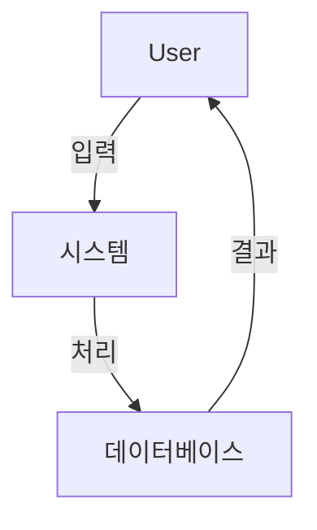
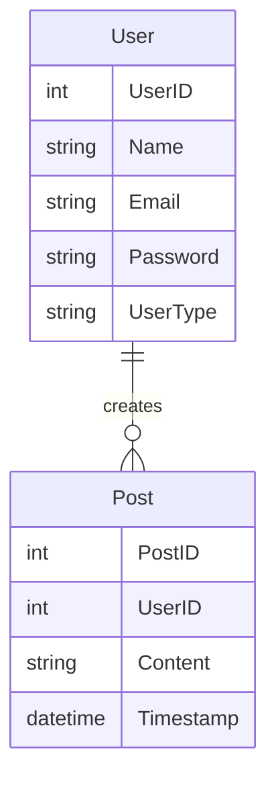
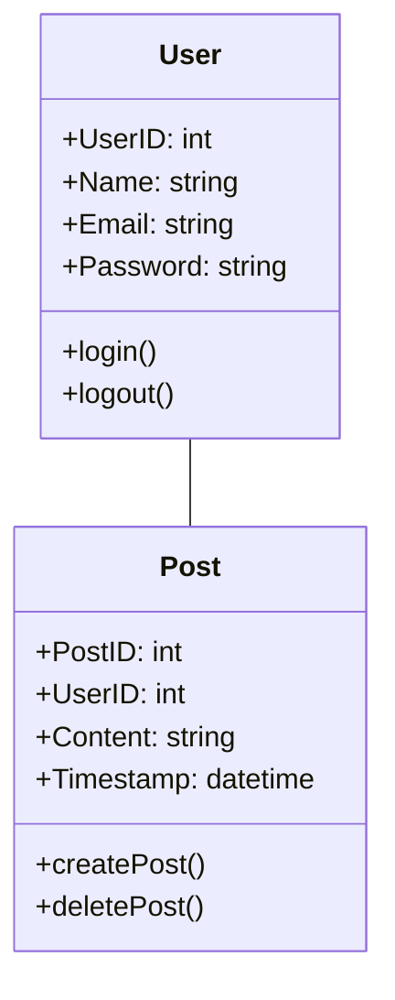
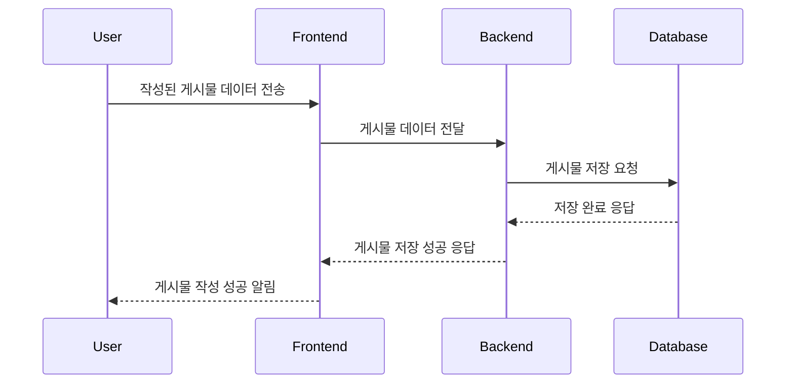
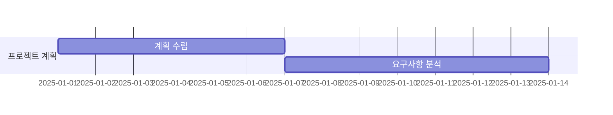
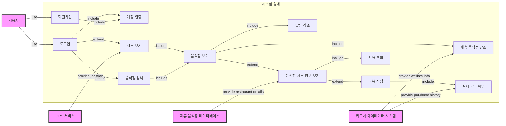

# 1. 금융 SNS 서비스

## 1.1 금융 SNS 서비스의 주요 기능

금융 SNS 서비스는 사용자가 금융 정보를 공유하고 소통할 수 있는 플랫폼입니다. 주요 기능으로는 사용자 간의 실시간 정보 교류, 투자 경험 공유, 맞춤형 금융 추천 등이 포함됩니다.

## 1.2 빅데이터 기반 금융서비스 종류

### 1.2.1 고객 맞춤형 서비스

사용자의 금융 데이터 분석을 통해 개인화된 금융 상품 및 서비스 추천을 제공합니다.

### 1.2.2 실시간 거래 분석

실시간으로 거래 데이터를 분석하여 시장 동향을 파악하고 사용자에게 유용한 정보를 제공합니다.

### 1.2.3 트렌드 분석 및 경제 예측

빅데이터를 활용해 시장 트렌드와 경제 상황을 예측하여 투자 결정을 지원합니다.

### 1.2.4 알고리즘 트레이딩 및 투자 전략

자동화된 알고리즘을 사용하여 투자 전략을 설계하고 실행합니다.

### 1.2.5 리스크 관리 및 사기 탐지

데이터 분석 기술을 활용해 금융 사기 및 리스크를 사전에 탐지하고 관리합니다.

### 1.2.6 고객 행동 분석 및 마케팅 전략

사용자 행동 데이터를 분석하여 효과적인 마케팅 전략을 수립합니다.

### 1.2.7 금융 상품 개발

새로운 금융 상품을 개발하기 위해 데이터 기반 통찰력을 제공합니다.

# 2. 시스템 개발 접근 방법

## 2.1 구조적 접근방법

### 2.1.1 데이터 흐름도 (DFD)

시스템의 데이터 흐름과 처리를 시각적으로 표현하여 프로세스를 이해하기 쉽게 만듭니다.



### 2.1.2 개체 관계 다이어그램 (ERD)

데이터베이스 설계를 위해 데이터 간의 관계를 시각적으로 표현합니다.



### 2.1.3 구조도

시스템의 계층적 구조를 나타내어 모듈 간의 관계를 명확히 합니다.

### 2.1.4 탑다운 모듈화 프로그래밍

시스템을 상위에서 하위로 점진적으로 세분화하여 개발하는 방법론입니다.

### 2.1.5 구조적 프로그래밍 구성 요소

순차, 선택, 반복 구조를 활용하여 효율적인 프로그램을 작성합니다.

## 2.2 객체지향 접근방법

### 2.2.1 디자인 클래스 다이어그램 (UML Design Class Diagram)

클래스 간의 관계와 구조를 설계하여 시스템을 시각적으로 표현



### 2.2.2 시퀀스 다이어그램 (UML Sequence Diagram)

객체 간의 상호작용을 시간 순서에 따라 표현



# 3. 시스템 개발 라이프사이클 (SDLC)

## 3.1 SDLC 단계별 작업

### 3.1.1 SDLC 단계 개요

- **기획**: 프로젝트 목표와 초기 계획 수립.
- **분석**: 사용자 요구사항을 수집하고 체계화.
- **설계**: 시스템의 구조 및 사용자 인터페이스 설계.
- **개발**: 시스템 구현 및 프로그래밍.
- **테스팅**: 기능 및 성능 테스트 수행.
- **설치**: 시스템 배포 및 설정.
- **유지보수**: 지속적인 문제 해결 및 개선.

## 기획 단계

### 초기 계획 및 리소스 관리

- **Request for IT Services**: IT 서비스 요청 및 요구사항 정의.
- **IT 서비스 계획 아웃라인**: 프로젝트 범위, 일정, 예산 계획 수립.
- **정보재고**: 기존 시스템 및 리소스 분석.

### 프로젝트 관리 프로세스

- **프로젝트 선택**
- **프로젝트 평가**: 프로젝트 성공 가능성과 중요도 평가
    - 가치사슬 분석
    - 조직전략과 정렬
    - 잠재적이익
    - 자원의 가용성
    - 프로젝트 사이즈/기간
    - 기술적 어려움/위
- **우선순위 결정**: 자원 배분을 고려한 작업 순서 설정.

### 작업 계획 도구

- **WBS (작업 분류 구조)**: 작업 세분화 및 관리.



- **주요 경로법 (CPM)**
    
    프로젝트를 끝내는 가장 긴 경로
    
    | 작업 | 소요시간(일) | 선행 작업 |
    | --- | --- | --- |
    | A | 3 | - |
    | B | 2 | A |
    | C | 5 | A |
    | D | 4 | B |
    | E | 3 | B |
    | F | 2 | C |
    | G | 6 | D, E, F |
    
    ```mermaid
    graph LR
        A["A: ES=0, EF=3, LS=0, LF=3"]:::critical --> B["B: ES=3, EF=5, LS=4, LF=6"]
        A -->|Critical Path| C["C: ES=3, EF=8, LS=3, LF=8"]:::critical
        B --> D["D: ES=5, EF=9, LS=6, LF=10"]
        B --> E["E: ES=5, EF=8, LS=7, LF=10"]
        C -->|Critical Path| F["F: ES=8, EF=10, LS=8, LF=10"]:::critical
        D --> G["G: ES=10, EF=16, LS=10, LF=16"]:::critical
        E --> G
        F -->|Critical Path| G
        classDef critical fill:#f96,stroke:#333,stroke-width:2px;
    
    ```
    
    ```mermaid
    gantt
        dateFormat  X
        title Critical Path with Days
        section Tasks
        A :crit, a1, 0, 3
        B :b1, 3, 5
        C :crit, c1, 3, 8
        D :d1, 5, 9
        E :e1, 5, 8
        F :crit, f1, 8, 10
        G :crit, g1, 10, 16
        %% Days markers
        section Timeline
        Day 0 :milestone, milestone1, 0, 0
        Day 3 :milestone, milestone2, 3, 3
        Day 5 :milestone, milestone3, 5, 5
        Day 8 :milestone, milestone4, 8, 8
        Day 10 :milestone, milestone5, 10, 10
        Day 16 :milestone, milestone6, 16, 16
    
    ```
    
- **네트워크 다이어그램**
    
    ```mermaid
    graph LR
        A[요구사항 분석] --> B[설계]
        B --> C[구현]
        C --> D[테스트]
    
    ```
    
- **간트 차트**
    
    프로젝트 스케쥴 보여주는 막대그래프
    
    ```mermaid
    gantt
    dateFormat  YYYY-MM-DD
    section 프로젝트 일정
    요구사항 분석       :2025-01-01, 10d
    설계               :2025-01-11, 20d
    구현               :2025-02-01, 30d
    테스트             :2025-03-03, 20d
    
    ```
    

## 분석 단계

### 시스템 요구사항 수집

- 사용자 요구사항을 수집하여 설계 및 개발의 기초 마련.

### 유즈케이스 다이어그램



- **시스템 경계(System Boundary)**
    
    응용 프로그램의 전산화된 부분과 응용 프로그램을 작동하지만 전체 시스템의 일부인 사용자 간의 경계 - 시스템 범위
    
    정사각형
    
- **행위자(Actors)**
    
    데이터를 제공 또는 수신하여 시스템과 상호작용 하는 개인 또는 그룹
    
    시스템의 일부가 아님 - 사람 또는 자동화 시스템
    
    - 주요 행위자(왼쪽)
        
        목적을 달성하기 위해 상호작용 시작
        
    - 지원 행위자(오른쪽)
        
        유즈케이스를 돕기 위해 부수적인 목표 수행
        
- **사용 사례(Use Cases)**
    
    사용자 요청으로 시스템이 수행하는 활동
    
    동사 + 명사
    
    - 행위자 기반
        
        
    - 이벤트 기반

**관계 유형**: 

- 연관 관계 (Association)
    
    액터와 유즈케이스 연결
    
    - <faculty> — (updating grades)
- 일반화 관계 (Generalization)
    
    유즈케이스는 다른 유즈케이스의 특별한 버전
    
    - (non-graduate registration) → (registration)
    (graduate registration) → (registration)
- 포함 관계 (Include)
    
    유즈케이스가 다른 유즈케이스의 일부
    
    - (sign in) --<<include>>-→ (verifying user)
        - 항상 포항되는 유즈케이스로 필수적인 행동 나타냄
        - 상위 유즈케이스가 실행될 때 반드시 하위 유즈케이스가 실행
- 확장 관계(Extend)
    
    다른 핵심 유즈케이스 행동을 확장
    
    - (write review) ←-<<extends>>--(sign in)
        - 기본 유즈케이스가 실행된 후 특정 조건 만족할 때만 추가적인 유즈케이스 실행

### 활동 다이어그램

사용자의 활동, 각 활동을 수행하는 사용자 및 이러한 활동의 순차적 흐름을 설명

- 객체지향에서 사용

### 데이터 흐름도와 플로우 차트 (DFD and Flow Chart)

- 구조 개발에서 사용

### 도메인 모델과 클래스 다이어그램 (Domain Model Class Diagram)

메소드는 없고 속성과 관계만 있음

### 객체 관계도 (Entity-Relationship Diagram)

구조적 개발에서 UML의 도메인 모델 클래스 다이어그램과 같은 것이 ERD

---

## 설계 단계 (System Design)

### 사용자 인터페이스 설계

- Top-Down Approach
    
    메뉴가 먼저 정의된 다음 각 대화형 사용 사례데 대한 자세한 설명과 관련 사용자 인터페이스 요소 개발
    
- Bottom-Up Approach
    
    대화형 사용 사례의 우선순위가 지저오디고 관련 대화상자 및 사용자 인터페이스가 한 번에 하나씩 개발
    
    메뉴는 완전히 구현된 사용자 인터페이스 관련 집합이 완료될 때 프로젝트 후반부에 추가
    

**메뉴**

**대화형 설계**

**와이어프레임**

**스토리보드 활용**

**사이트맵**: 페이지 간 관계 정의.

### 환경 설계

- **네트워크 다이어그램**: 시스템 통신 구조 설계.

### **어플리케이션 아키텍처와 소프트웨어 설계**

**Software Architecture**

- **MVC**
    - Model: 데이터 관리
    - View: 유저 인터페이스
    - Controller: 사용자 리퀘스트

**Design of each use case (UML Diagram)**

- 클래스 다이어그램:
    
    시스템 구조 설명
    
    - Classes
    - Attributes
    - Operations(Methods)
    - Relationships among the classes
    
    ```mermaid
    classDiagram
        class User {
            +UserID: int
            +Name: string
            +Email: string
            +login()
            +logout()
        }
        class Post {
            +PostID: int
            +UserID: int
            +Content: string
            +Timestamp: datetime
            +createPost()
            +deletePost()
        }
        User -- Post
    
    ```
    
- 시퀀스 다이어그램:
    
    특정 행동이 어떤 순서로 어떤 객체와 어떻게 상호작용 하는 지 표현
    
    ```mermaid
    sequenceDiagram
        User->>System: 로그인 요청
        System->>Database: 사용자 정보 확인
        Database-->>System: 인증 성공
        System-->>User: 로그인 성공
    
    ```
    
- 상태머신 다이어그램

### 시스템 인터페이스 설계

- XML(eXtensivle Markup Language)
    
    텍스트 기반 시스템 인터페이스
    

### 데이터베이스 설계

### 보안과 시스템 제어 설계

- 시스템 접근 제한
- 거래, 작업 기록
- 하드웨어, 소프트웨어 실패로 인해 사고손실과 권한 없는 접근으로 데이터 보호
- 네트워크를 통한 통신의 보호

## 개발 단계

### 구현

- 프로그래밍 및 코드 품질 관리.

## 테스팅 단계

구성요소, 서브시스템, 시스템에 결함이 있는지, 잘 운영되는지 시험

### 테스트 케이스 작성 및 실행

- 테스트 케이스 설계와 결과 분석.

### 테스팅 종류

- **단위 테스트**: 개별 모듈 테스트.
- **수용 테스트**: 사용자 요구사항 충족 여부 확인.
- **성능 테스트**: 시스템 처리 속도 및 효율성 평가.
- **베타 테스트**: 최종 사용자 테스트.

---

## 설치 및 유지보수

### 설치

- 시스템 배포 및 환경 설정.

### 유지보수

- 지속적인 문제 해결 및 기능 개선.
