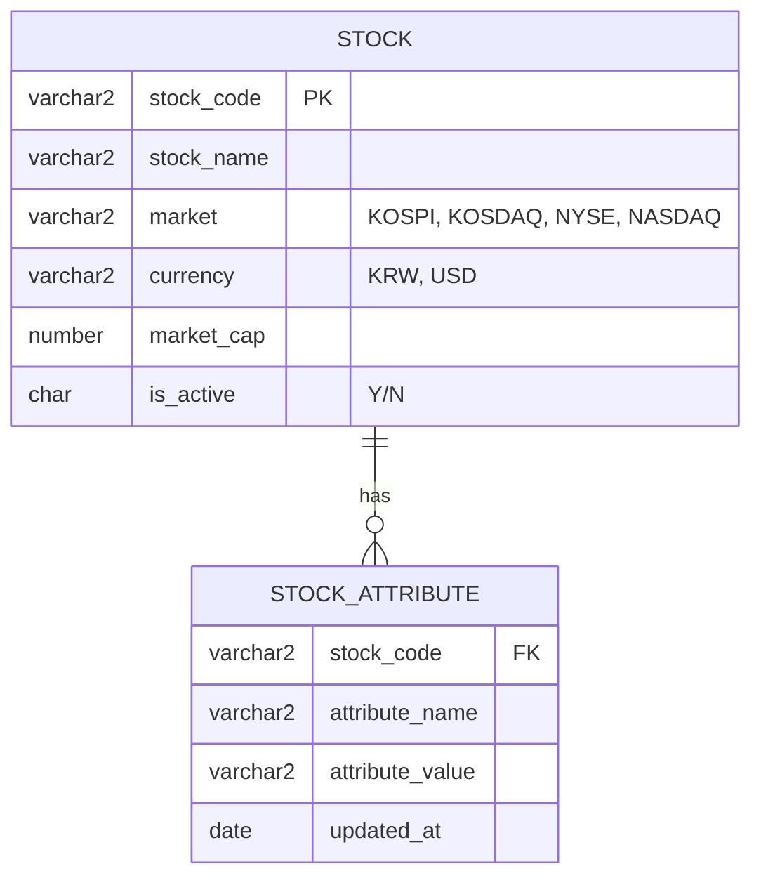

# 📌 환율, 주가처럼 실시간으로 변동하는 속성을 DB에 넣어도 되는가

환율을 일단 LOG 데이터로

주가도 아마도?

# 📌 계좌는 하나인데 통화는 두 개 이상?

# 📌 `market`, `currency`를 ENUM처럼 사용해도 괜찮을까?

**✅ 결론: VARCHAR2 그대로 두고, 백엔드에서 ENUM으로 처리하는 게 유연함.**

**이유**

1. **가독성 & 유지보수 용이**
    - `market = 'NYSE'` 이런 식으로 바로 의미를 파악할 수 있음.
    - 숫자로 저장하면 `1 = KOSPI`, `2 = NASDAQ` 같은 매핑을 추가로 관리해야 함.
2. **확장성 고려**
    - 새로운 시장이 생기거나(`LSE` - 런던 증권거래소), 다른 통화(`EUR` - 유로) 추가 시, ENUM을 변경하려면 마이그레이션 필요함.
    - VARCHAR2로 관리하면 새로운 값을 추가할 때 테이블 변경이 필요 없음.

**그래서 어떻게 처리할까?**

- **DB에서는 VARCHAR2 사용**
- **백엔드에서는 ENUM으로 관리**
    - 예를 들어, Java에서는 `enum Market { KOSPI, KOSDAQ, NYSE, NASDAQ }`
    - DB에선 `VARCHAR2 market` 필드 그대로 유지

---

# 📌 주식 종목 속성을 어떻게 저장할까?

**✅ 결론: 별도 테이블로 분리하는 게 좋음!**

### **이유**

1. **정규화 & 중복 최소화**
    - 예를 들어, `STOCK` 테이블에서 **업종(category), 시가총액, PER, PBR, 배당률 등** 속성을 저장하려면?
    - `STOCK` 테이블이 비대해지고 중복 데이터가 많아질 가능성이 있음.
    - 종목 속성은 종목 코드(`stock_code`)를 키로 **별도 테이블에서 관리하는 게 더 효율적**
2. **데이터 변경이 빈번함**
    - 업종, PER 같은 데이터는 시간이 지나면서 변경됨.
    - `STOCK_ATTRIBUTE` 같은 테이블을 따로 두면, 종목별 속성을 동적으로 업데이트하기 용이함.

### **테이블 설계 예시**



**이렇게 하면 장점이 있음!**

- **유연성**: 새로운 속성 추가 시 테이블 구조 변경 없이 추가 가능
- **데이터 변경 용이**: `STOCK_ATTRIBUTE`에서 특정 속성만 업데이트 가능
- **확장성**: 나중에 AI 분석 정보 같은 새로운 속성을 추가할 수도 있음

---

### 🚀 결론

- **`market`, `currency`는 VARCHAR2 유지하고 백엔드에서 ENUM 처리**
- **주식 속성은 별도 `STOCK_ATTRIBUTE` 테이블로 관리하는 게 확장성과 유지보수 측면에서 유리함**

---

# 📌 `user_id`를 UUID로 하는 게 좋을까?

---

# **📌 예치금 부족 시 주문 불가능한 경우 (토스 증권과 같은 모델)**

---

🚀 **토스 증권처럼 예치금이 부족하면 주문(ORDER) 자체가 불가능한 방식**을 적용하려면

**"ORDER 생성 전에 예치금 잔액을 확인"**하는 과정이 필요합니다.

즉, **ORDER가 생성되기 전**에 **증권 계좌(ACCOUNT)의 잔액을 확인**하고,

💡 **잔액이 부족하면 ORDER를 생성하지 않도록 예외 처리**해야 합니다.

---

## **1️⃣ 백엔드 로직 (잔액 검증 및 ORDER 제한)**

1. **사용자가 `ORDER`를 요청**
2. **백엔드에서 `ACCOUNT.balance_krw` 확인**
    - ✅ 예치금이 충분하면 → `ORDER` 생성 진행
    - ❌ 예치금이 부족하면 → 주문 실패 (예외 반환)
3. **주문이 성공하면 `TRANSACTION` 테이블에 반영**

---

## **2️⃣ 백엔드 ORDER 생성 로직**

```sql
SELECT balance_krw
FROM ACCOUNT
WHERE account_id = 'A001';

```

💡 `ACCOUNT.balance_krw`를 조회하여 주문 금액과 비교

---

### **✅ 예치금이 충분한 경우 (`balance_krw >= 주문 금액`)**

1. `ORDER` 생성 (`PENDING` 상태)
2. `TRANSACTION` 테이블에 **ORDER 금액을 차감**하는 내역 반영
3. **거래 체결 시(`TRADE`) 계좌 잔액에서 최종 차감**

```sql
INSERT INTO ORDER (order_id, account_id, stock_code, order_type, quantity, price, status, order_time)
VALUES ('O10002', 'A001', '005930', 'BUY', 1, 100000, 'PENDING', SYSDATE);

```

```sql
INSERT INTO TRANSACTION (transaction_id, account_id, amount, currency, transaction_type, related_id, related_type, transaction_time)
VALUES ('TX20002', 'A001', -100000, 'KRW', 'ORDER', 'O10002', 'ORDER', SYSDATE);

```

| transaction_id | account_id | amount | transaction_type | related_id | related_type | transaction_time |
| --- | --- | --- | --- | --- | --- | --- |
| TX20002 | A001 | -100,000 | ORDER | O10002 | ORDER | 10:00:00 |

💡 **ORDER가 생성되면, 예치금에서 해당 금액이 잠김**

---

### **❌ 예치금이 부족한 경우 (`balance_krw < 주문 금액`)**

```json
POST /api/order
{
    "account_id": "A001",
    "stock_code": "005930",
    "order_type": "BUY",
    "quantity": 1,
    "price": 100000
}

```

✅ **백엔드에서 ORDER 요청을 받으면 먼저 잔액 확인**

```sql
SELECT balance_krw
FROM ACCOUNT
WHERE account_id = 'A001';

```

❌ **잔액이 부족하면 예외 반환**

```json
{
    "error": "INSUFFICIENT_FUNDS",
    "message": "예치금이 부족합니다. 충전 후 주문을 진행해주세요."
}

```

💡 주문이 아예 불가능하며, `ORDER` 테이블에 **기록되지 않음**.

---

## **3️⃣ 백엔드 로직 흐름**

```mermaid
graph TD;
  A[사용자 ORDER 요청] --> B(예치금 확인);
  B -->|잔액 충분| C[ORDER 생성]
  B -->|잔액 부족| D[주문 실패 (예외 반환)]
  C --> E[TRANSACTION 생성 (예치금 잠금)]
  E --> F[TRADE 체결 후 실제 금액 차감]
  D -->|잔액 부족 메시지 반환| A

```

---

## **4️⃣ `TRANSACTION` 테이블에 미치는 영향**

| 상황 | TRANSACTION 반영 여부 | 관련된 트랜잭션 타입 |
| --- | --- | --- |
| 예치금 충분 | `ORDER` 시 예치금 차감됨 | `ORDER` (거래 발생) |
| 예치금 부족 | `ORDER` 불가능 | 없음 |

✅ **토스 증권처럼 예치금이 부족하면 ORDER 자체를 막고, TRANSACTION 기록도 남지 않음.**

✅ **반대로 예치금이 충분하면 ORDER를 생성하고, TRANSACTION을 기록하여 금액을 잠금 처리함.**

---

## **5️⃣ 결론**

### ✅ **"예치금이 부족하면 주문 불가" 방식을 적용하려면**

1. **ORDER 생성 전에 예치금을 검증해야 함**
2. **잔액이 부족하면 주문 실패 예외를 반환 (`INSUFFICIENT_FUNDS`)**
3. **예치금이 충분하면 ORDER 생성 후 TRANSACTION에 기록**
4. **ORDER가 체결(TRADE)될 때만 최종적으로 계좌 잔액을 차감**

---

# **`transaction_type`과 `related_type` 을 모두 유지해야하는가**

좋은 질문이에요! **`transaction_type`과 `related_type`이 모두 필요한지**를 고민해보면,

- *`transaction_type`*은 거래의 성격(입금, 출금, 주문, 체결 등)을 나타내고,
- *`related_type`*은 이 거래가 연결된 데이터(`ORDER`, `TRADE` 등)의 유형을 나타냅니다.

두 개가 모두 필요할지, 하나로 줄일 수 있을지 자세히 살펴보겠습니다.

---

## **1️⃣ `transaction_type`과 `related_type` 역할 비교**

### **✅ `transaction_type` (거래 유형)**

- 해당 거래(`TRANSACTION`)가 어떤 유형인지 표시
- 주요 값:
    - **`DEPOSIT`** → 입금
    - **`WITHDRAWAL`** → 출금
    - **`ORDER`** → 주문 시 자금 차감
    - **`ORDER_CANCELLED`** → 주문 취소 시 자금 반환
    - **`TRADE_CONFIRMED`** → 체결 완료된 주문
- 실제 `TRANSACTION`의 **비즈니스 로직을 결정하는 핵심 필드**

### **✅ `related_type` (연결된 데이터 유형)**

- 거래(`TRANSACTION`)가 어떤 데이터(`ORDER`, `TRADE`, `BANK_TRANSFER` 등)와 연결되어 있는지 표시
- 주요 값:
    - **`ORDER`** → `ORDER` 테이블과 연결
    - **`TRADE`** → `TRADE` 테이블과 연결
    - **`BANK_TRANSFER`** → `BANK_ACCOUNT`와 연결

---

## **2️⃣ `related_type`을 없애고 `transaction_type`으로만 구별할 수 있을까?**

이론적으로는 **`related_type`을 없애고 `transaction_type`만으로 관리**할 수도 있습니다.

그러나, **이 두 개의 필드를 구분하면 몇 가지 이점이 생깁니다.**

### **🚀 `related_type`이 필요한 이유**

1️⃣ **데이터 연결을 명확하게 구분할 수 있음**

- `transaction_type = 'ORDER'`이면 주문 시 자금 차감이지만,**어떤 주문(`ORDER`)인지 확인하려면 `related_type = 'ORDER'`로 구별하는 게 직관적**
- 예를 들어, `transaction_type = 'DEPOSIT'`일 때
→ `related_type = 'BANK_TRANSFER'`이면 은행에서 증권 계좌로 입금한 것이고,
→ `related_type = 'ORDER'`이면 주문 취소 후 증거금 반환을 의미

2️⃣ **유지보수 및 확장성 증가**

- 만약 `transaction_type`만 사용한다면, `ORDER`와 `TRADE`를 구별하기 어려울 수 있음.
→ 예: `transaction_type = 'TRADE_CONFIRMED'`이면 실제 체결된 거래지만,
→ 어떤 테이블(`ORDER` 또는 `TRADE`)과 연결되었는지 명확하지 않음.

3️⃣ **은행 계좌 연동 시 활용 가능**

- `transaction_type = 'DEPOSIT'` 또는 `WITHDRAWAL'`일 때,
→ `related_type = 'BANK_TRANSFER'`이면 은행과 연동된 거래임을 쉽게 구별할 수 있음.

---

## **3️⃣ `transaction_type`만 남기고 `related_type`을 없애면 생기는 문제**

만약 **`related_type`을 없애고 `transaction_type`만 유지한다면**,

데이터를 다룰 때 **명확성이 떨어지는 문제**가 발생할 수 있습니다.

**예제:**

```sql
SELECT * FROM TRANSACTION WHERE transaction_type = 'ORDER';

```

✅ 주문(`ORDER`) 관련 데이터만 조회하려고 했지만,

❌ 은행 입금(`BANK_TRANSFER`) 후 주문 취소(`ORDER_CANCELLED`)된 데이터까지 섞일 가능성이 있음.

따라서, **"이 TRANSACTION이 어떤 데이터와 연결되어 있는지"를 쉽게 알기 위해 `related_type`이 필요합니다.**

---

## **4️⃣ 결론: `transaction_type`과 `related_type`을 모두 유지하는 것이 좋다!**

| 필드명 | 필요성 | 설명 |
| --- | --- | --- |
| ✅ `transaction_type` | **필수** | 거래 유형을 구분하는 핵심 필드 |
| ✅ `related_type` | **필수** | 어떤 테이블과 연결되었는지 명확하게 구분 |

📌 **최종 정리**

✅ `transaction_type` → "이 거래가 어떤 유형인가?" (`ORDER`, `TRADE`, `DEPOSIT`, `WITHDRAWAL` 등)

✅ `related_type` → "이 거래는 어떤 데이터(`ORDER`, `TRADE`, `BANK_TRANSFER`)와 연결되었는가?"

**따라서, `transaction_type`과 `related_type`을 함께 유지하는 것이 가장 효율적인 설계입니다!** 🚀🔥

# **📌 `TRANSACTION` 테이블에 `BUY/SELL`이 필요 없는 이유 (간단 정리)**

✅ **1️⃣ `TRANSACTION`은 돈의 흐름을 기록하는 테이블**

- `BUY/SELL`은 주식 매매를 구분하는 개념이지만,
- `TRANSACTION`은 **계좌에서 돈이 이동한 이유(입출금, 주문, 체결 등)를 관리**함.
- **즉, 돈이 들어오고 나가는 것만 중요**하며 `BUY/SELL`과 관계없음.

✅ **2️⃣ `transaction_type`으로 거래 성격을 구별 가능**

- `DEPOSIT`, `WITHDRAWAL` → **은행 거래**
- `ORDER`, `TRADE` → **주식 거래**
- `BUY/SELL` 없이도 **이 유형만으로 충분히 의미 전달 가능**

✅ **3️⃣ `BUY/SELL`은 `ORDER`와 `TRADE`에 이미 존재**

- `ORDER.order_type = 'BUY' or 'SELL'`
- `TRADE.trade_type = 'BUY' or 'SELL'`
- `TRANSACTION`에서는 `related_id`를 통해 해당 `ORDER` 또는 `TRADE`를 참조하면 충분

📌 **결론**

🔹 `TRANSACTION`은 계좌 자금 흐름을 추적하는 역할이므로 `BUY/SELL`이 필요 없음.

🔹 `ORDER`와 `TRADE`에 이미 `BUY/SELL` 정보가 있어 중복될 필요가 없음.

🔹 `transaction_type`과 `related_type`만으로 거래 유형을 구분하는 것이 더 적절함.

🚀 **즉, `TRANSACTION`은 돈이 "왜" 이동했는지를 관리하는 테이블이므로, `BUY/SELL` 없이도 충분히 의미 전달 가능!**
