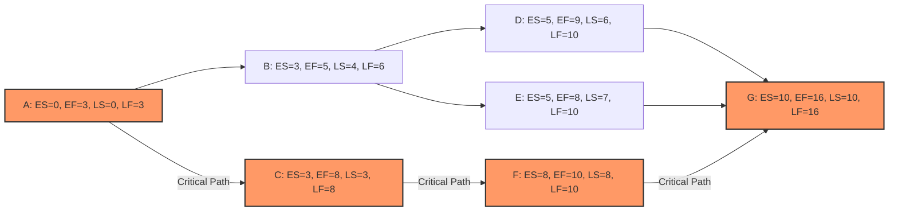

# CPM

| 작업 | 소요시간(일) | 선행 작업 |
| --- | --- | --- |
| A | 3 | - |
| B | 2 | A |
| C | 5 | A |
| D | 4 | B |
| E | 3 | B |
| F | 2 | C |
| G | 6 | D, E, F |

```mermaid
graph LR
    A["A: ES=0, EF=3, LS=0, LF=3"]:::critical --> B["B: ES=3, EF=5, LS=4, LF=6"]
    A -->|Critical Path| C["C: ES=3, EF=8, LS=3, LF=8"]:::critical
    B --> D["D: ES=5, EF=9, LS=6, LF=10"]
    B --> E["E: ES=5, EF=8, LS=7, LF=10"]
    C -->|Critical Path| F["F: ES=8, EF=10, LS=8, LF=10"]:::critical
    D --> G["G: ES=10, EF=16, LS=10, LF=16"]:::critical
    E --> G
    F -->|Critical Path| G
    classDef critical fill:#f96,stroke:#333,stroke-width:2px;

```
