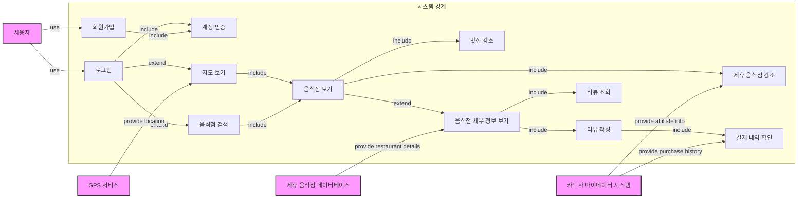

```mermaid
flowchart LR
    %% Define Actors with Distinct Style
    classDef actorStyle fill:#f9f,stroke:#333,stroke-width:2px;

    %% Define System Boundary and Use Cases
    subgraph "시스템 경계"
        Login["로그인"]
        Signup["회원가입"]
        AccountVerification["계정 인증"]
        ViewMap["지도 보기"]
        SearchRestaurants["음식점 검색"]
        ViewRestaurants["음식점 보기"]
        HighlightAffiliates["제휴 음식점 강조"]
        HighlightPopular["맛집 강조"]
        RestaurantDetails["음식점 세부 정보 보기"]
        WriteReview["리뷰 작성"]
        ViewReviews["리뷰 조회"]
        CheckPurchaseHistory["결제 내역 확인"]
    end

    %% Define Primary Actor
    사용자["사용자"]

    %% Define Support Actors
    GPS["GPS 서비스"]
    CardData["카드사 마이데이터 시스템"]
    AffiliateDB["제휴 음식점 데이터베이스"]

    %% Apply Actor Styles
    class 사용자,GPS,CardData,AffiliateDB actorStyle;

    %% Define Relationships
    사용자 -->|use| Login
    사용자 -->|use| Signup
    Login -->|include| AccountVerification
    Signup -->|include| AccountVerification

    Login -->|extend| ViewMap
    Login  -->|extend| SearchRestaurants

    ViewMap -->|include| ViewRestaurants
    SearchRestaurants -->|include| ViewRestaurants
    ViewRestaurants -->|include| HighlightAffiliates
    ViewRestaurants -->|include| HighlightPopular
    ViewRestaurants -->|extend| RestaurantDetails

    RestaurantDetails -->|include| ViewReviews
    RestaurantDetails -->|include| WriteReview
    WriteReview -->|include| CheckPurchaseHistory

    %% Support Actors Relationships
    GPS -->|provide location| ViewMap
    CardData -->|provide affiliate info| HighlightAffiliates
    AffiliateDB -->|provide restaurant details| RestaurantDetails
    CardData -->|provide purchase history| CheckPurchaseHistory

```
